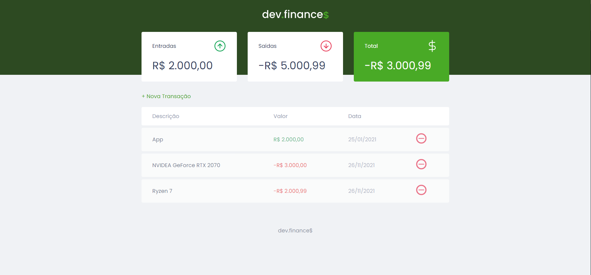

<h2> Maratona Discovery Project</h2>

<h1 align="center">
  
</h1>
  
<p align="center">
  
  
  <a href="https://github.com/VictorMello1993/FlappyBird/commits/master">
    
  </a> 
  
  
   <a href="https://github.com/VictorMello1993/MaratonaDiscovery/stargazers"></a>
</p>

<p align="center">
  <a href="#earth_americas-overview">Overview</a> •
  <a href="#wrench-features">Features</a> •
  <a href="#triangular_flag_on_postgetting-started">Getting started</a> •  
  <a href="#improvements-to-build">Improvements to build</a> •  
</p>

<h2>:earth_americas: Overview</h2>
<p>App built whose purpose is to review front-end (HTML, CSS e JS) knowledges teached on Maratona Discovery, 
     promoted by <a href="https://rocketseat.com.br/">Rocketseat</a>. It's about a finnance app which simply calculates how much you earned (incomes), and how much you spent (expenses). 
     Because it's a simple app, there was no need to implement back-end to storage data on a database server, for example, 
     saving the performance. Thus, all data is stored in the browser memory (Local Storage) directly.
</p>

---

<h2>:wrench: Features</h2>
<ul>
  <li>HTML</li>
  <li>CSS</li>
  <li>JavaScript</li>
</ul>

---

<h2>:triangular_flag_on_post:Getting started</h2>

1- Clone the repository
```
git clone https://github.com/VictorMello1993/MaratonaDiscovery.git
```
2 - Open VS Code and go to the folder "MaratonaDiscovery"

3 - Type in your browser to access the app
```
localhost:5500
```

<p>Done, the app is running! Realize that because it's an app built 100% front-end, there was no need to run the NodeJs commands because there was no need to create a server
   to work.
</p>


---


<h2>:crescent_moon:Dark mode</h2>


<p><i>Referências: <a href="https://github.com/andrePereira11/maratonaDiscover">André Luís</a></i></p>

<p>To make it even more realistic, in addition to including dark mode, the logic of maintaining the background state of the page saved in Local Storage has been implemented, so that every time the user refreshes in the browser, the page is rendered exatly on which theme was selected last time, without losing any information and always backing to the default state, the light mode.</p>


---


## Improvements to build
- [ ] Add a new page that displays error messages which may occur when the user adds and/or removes a transaction, instead of displaying a message with ```alert()``` from the browser
- [x] Add dark theme

---
## README Versions
  <a href="/README-ENUS.md">English</a> |  <a href="/README.md">Portuguese</a>

