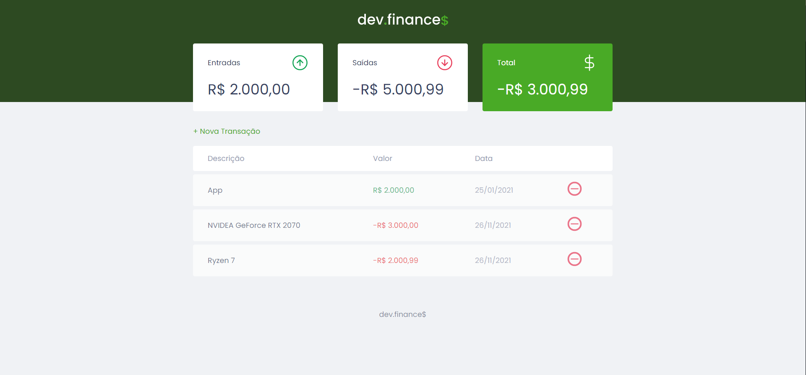

<h2> Projeto Maratona Discovery</h2>

<h1 align="center">
  
</h1>
  
<p align="center">
  
  
  <a href="https://github.com/VictorMello1993/FlappyBird/commits/master">
    
  </a> 
  
  
   <a href="https://github.com/VictorMello1993/MaratonaDiscovery/stargazers"></a>
</p>

<p align="center">
  <a href="#earth_americas-visão-geral">Visão geral</a> •
  <a href="#wrench-recursos">Recursos</a> •
  <a href="#triangular_flag_on_postcomeçando">Começando</a> •  
  <a href="#melhorias-a-implementar">Melhorias a implementar</a> •  
</p>

<h2>:earth_americas: Visão geral</h2>
<p>Aplicação construída com intuito de revisar os conhecimentos de front-end (HTML, CSS e JS) abordados na Maratona Discovery, promovida pela <a href="https://rocketseat.com.br/">Rocketseat</a>. Trata-se de uma aplicação de finanças que simplesmente calcula quanto você vendeu (entrada), e quanto você comprou (saída). Por ser uma aplicação simples, não foi preciso implementar o back-end para armazenar os dados em um servidor de bancos de dados, por exemplo, poupando o desempenho. Assim, todos os dados são armazenados diretamente na memória do navegador (Local Storage).</p>

---

<h2>:wrench: Recursos</h2>
<ul>
  <li>HTML</li>
  <li>CSS</li>
  <li>JavaScript</li>
</ul>

---

<h2>:triangular_flag_on_post:Começando</h2>

1- Clone o repositório
```
git clone https://github.com/VictorMello1993/MaratonaDiscovery.git
```
2 - Abra VS Code e acesse a pasta "MaratonaDiscovery"

3 - Digite em seu navegador para acessar a aplicação
```
localhost:5500
```

Pronto, a aplicação está rodando! Perceba que como se trata de uma aplicação 100% front-end, não foi preciso executar os comandos do NodeJs porque não foi preciso criar um servidor para funcionar.

---

## Melhorias a implementar
- [ ] Adicionar uma nova página que exibe as mensagens de erro que podem acontecer quando o usuário adiciona e/ou exclui uma transação, em vez de exibir a mensagem com alert()         do navegador
- [ ] Incluir modo escuro
- [ ] Encontrar os potenciais bugs e corrigí-los

---
## Versões do README
<a href="/README-ENUS.md">Inglês</a> | <a href="/README.md">Português</a>
